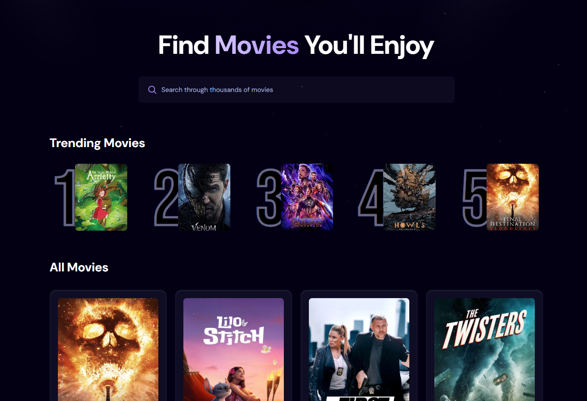

# 🎬 React Movie App




A simple movie search app I built while learning React.
You can search for movies, and the app keeps track of which movies users look up the most to display a list of trending titles.

## 🔍 Features

- 🔎 **Search for movies** with a responsive search bar
- 🕒 **Debounced input** using a custom `useDebounce` hook to optimize API calls
- 📊 **Trending movies** based on user search counts

## 🛠️ Built With

- [React](https://reactjs.org/)
- [Vite](https://vitejs.dev/)
- [Appwrite](https://appwrite.io/docs)

## 🚀 Getting Started

To run this project locally:

1. Clone the repo:
   ```bash
   git clone https://github.com/yourusername/react-movie-search.git
   cd react-movie-search

2. Install dependencies:
    ```bash
   npm install

3. Set up your Appwrite project:
- Create a database with a collection for movie searches

- Update your Appwrite endpoint, project ID, and collection ID in the environment variables

4. Start the app:
    ```bash
    npm run dev
## 🚧 Future Features

Here's what I plan to implement next:

- User authentication
- Movie details page
- Filtering by genre, year, and rating
- Dark Theme toggle